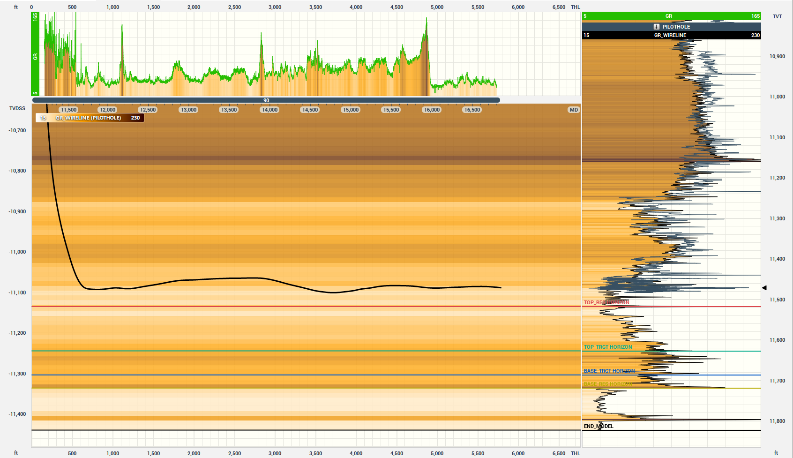
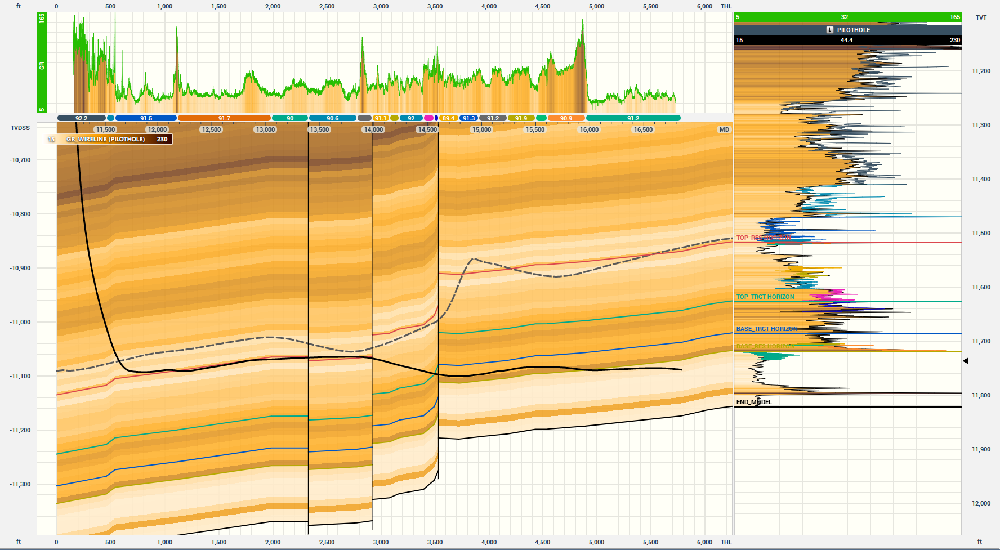

# Geological Layer-Depth Sequence Prediction

  
*Figure 1: Geology with parallel horizontal layers*

  
*Figure 2: Actual 1D geology with faults and dips*

## Project Overview
This project addresses the challenge of predicting geological layer-depth sequences for horizontal well drilling operations. Subsurface geology exhibits inherent uncertainty due to complex deposition patterns and tectonic deformations. Our data-driven model generates 10 geological realizations (300 positions each) to account for prediction uncertainty, supporting geosteering decisions during drilling operations.

## Problem Statement
### Task
Predict 1D geological layer sequences (delta_z values) along lateral wells using:
- Known geological data from columns -299 to 0 (current drilling position)
- Generate 10 equiprobable realizations for positions 1-300

### Key Challenges
1. Handling partial observations with guaranteed data only from -49 to 0
2. Modeling geological deformations (faults and dips)
3. Generating diverse predictions while maintaining accuracy

## Dataset
### Structure
| Column Range        | Description                                  | Normalization      |
|---------------------|----------------------------------------------|--------------------|
| geology_id          | Unique hash-based identifier                 | -                  |
| -299..0             | Observed Z-coordinates (partial data)       | Z(0) = 0           |
| 1..300              | True geology (realization 0)                | Competition target |
| r_{1-9}_pos_{1-300} | Additional realizations (1-9)               | Equiprobable       |

### Key Characteristics
- Training data contains complete true geology for all realizations
- Test data contains only partial observations (-299 to 0)
- Position values represent feet relative to drill bit

## Evaluation Metric
### Negative Log Likelihood (NLL)
The evaluation uses a weighted NLL loss accounting for position-dependent errors:

```math
loss = -log\left(\frac{1}{10}\sum_{i=0}^9 \exp\left(e_i(x) \cdot D_T^{-1}(x) \cdot e_i(x)\right)\right)
```

Where:
- `e_i(x) = b_T(x) - b_i(x)` (prediction error)
- `D_T^{-1}(x)` = Position-dependent covariance matrix:
```python
log_slopes = [1.0406, 0.0, 7.8353]
log_offsets = [-6.4307, -2.1617, -45.2488]
```

## Solution Approach
[Coming soon]

## Getting Started
### Installation
[Coming soon]

### Usage
[Coming soon]

### Reproducibility
```python
# Set random seeds
SEED = 42
torch.manual_seed(SEED)
np.random.seed(SEED)
random.seed(SEED)
```

## References
1. Alyaev & Elsheikh (2022) - Geological boundary modeling
2. Muhammad et al. (2024) - Particle filter applications in geosteering
3. [ROGII Inc.](https://www.rogii.com/) - Competition sponsor and data provider